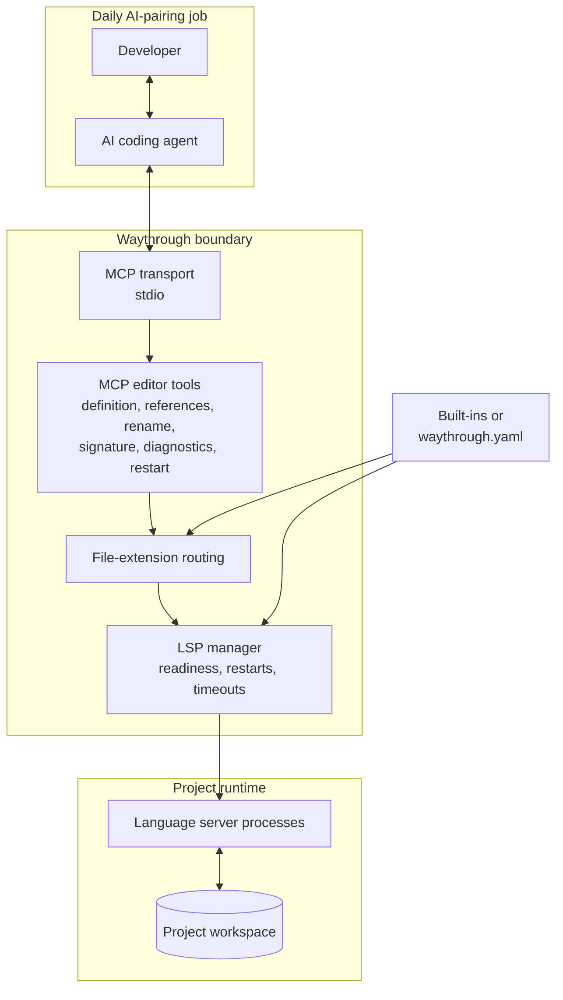

# Waythrough

Coding agents are great at reading code. Navigating an unfamiliar
codebase is harder: without language tooling, an agent has to search
for matching text and guess which definition or reference actually
matters.

Waythrough gives your agent a map. It runs your project's Language
Server Protocol (LSP) servers and exposes their code intelligence
through the Model Context Protocol (MCP). That means agents such as
Claude Code, Codex, and Antigravity can jump to definitions, find
references, inspect diagnostics, and safely plan renames—the same
kind of help you expect from a modern editor.

Instead of making your agent piece the codebase together one text
search at a time, let it ask the tools that already understand your
code.

## Architecture and the daily pairing loop

Waythrough sits between an AI coding agent and the project workspace. It
is the code-intelligence and language-server lifecycle layer: the agent
still owns the reasoning, edits, tests, and final decisions, while
Waythrough gives it precise answers from the language servers that already
understand the code.



A typical AI-pairing coding day uses the boundary like this:

1. **Orient.** The agent asks for definitions and references instead of
   guessing from matching text.
2. **Understand.** It uses signature help and diagnostics while it works
   through an unfamiliar API or a failing change.
3. **Change.** The agent edits the workspace. `rename_symbol` returns a
   cross-file edit plan; it does not write files on the agent's behalf.
4. **Validate.** The agent runs the project's tests and checks, then uses
   diagnostics or a targeted `restart_server` when a language server is
   stale or unhealthy.
5. **Review and repeat.** The agent brings the results back to the
   developer for the next decision.

Built-in language servers start on demand, so a normal session pays for
the language tooling it actually uses. An explicit `waythrough.yaml`
replaces the built-in configuration when a project needs different
commands, readiness gates, or file mappings.

## Status

This project is in early setup. It has six MCP tools. Tests run
them against a test language server, not against a real one yet.

## Install

Waythrough publishes binaries for Linux and macOS, each for amd64 and
arm64. Use the installer you already have.

### Homebrew

This project is also its own Homebrew tap. Run these commands:

```sh
brew tap gustavofsantos/waythrough https://github.com/gustavofsantos/waythrough
brew trust gustavofsantos/waythrough
brew install waythrough
```

Homebrew 6 refuses to load a formula from a tap that you do not trust,
so the `brew trust` command is necessary. That command is new in
Homebrew 6. On an older Homebrew it does not exist, so skip it.

### mise

[mise](https://mise.jdx.dev) takes the binary straight from the GitHub
release through its `github` backend, so this path needs no Go
toolchain. Run this command:

```sh
mise use -g github:gustavofsantos/waythrough
```

To pin one version, name the release tag without its leading `v`:

```sh
mise use -g github:gustavofsantos/waythrough@0.1.0
```

An older mise names this same backend `ubi`. That name still works,
and mise removes it in 2027.1.

To build from source instead, use the `go` backend. This path needs
the Go toolchain, at the version in [go.mod](go.mod):

```sh
mise use -g go:github.com/gustavofsantos/waythrough/cmd/waythrough
```

A binary from the `go` backend reports its version as `dev`, because
`go install` does not apply the version flag that the release build
sets. Prefer the `github` backend when the version matters.

### From source

This path needs the Go toolchain, at the version in [go.mod](go.mod),
and GNU Make:

```sh
git clone https://github.com/gustavofsantos/waythrough
cd waythrough
make install
```

`make install` compiles the checkout, installs the binary with
`go install`, stamps the version from `git describe`, and then checks
that the `waythrough` your shell finds is the binary it just installed,
rather than an older copy from another installer. Run `make` with no
target to list the rest, or see
[CONTRIBUTING.md](CONTRIBUTING.md#dogfood-your-change).

## Quick start

1. Install the language server for the code you work on. Waythrough has
   built-in startup and file-routing defaults for these servers:

   | Languages | Server command |
   | --- | --- |
   | Clojure | `clojure-lsp` |
   | Go | `gopls` |
   | JavaScript and TypeScript | `typescript-language-server --stdio` |
   | Rust | `rust-analyzer` |
   | Python | `pyright-langserver --stdio` |

   The command must be on the `PATH` the coding agent gives Waythrough.

2. Add Waythrough as an MCP server in your coding agent's config. Have
   the agent start it with the project root as its working directory:

   ```json
   {
     "mcpServers": {
       "waythrough": {
         "command": "waythrough",
         "args": ["serve"]
       }
     }
   }
   ```

   With no `waythrough.yaml` in that directory, `serve` uses the built-in
   defaults and starts each server only when a tool first needs its file
   type. Ask your coding agent to find a definition or list references.
   Waythrough forwards the request to that file type's server.

3. Tell your agent to use the tools. An agent that does not know they
   exist keeps searching for text. `waythrough instructions` writes a
   short block into the rules file your agent already reads:

   ```sh
   waythrough instructions --write AGENTS.md
   ```

   Use `CLAUDE.md`, `.cursor/rules/waythrough.md`, or whatever your tool
   reads in place of `AGENTS.md`. Waythrough appends the block the first
   time and replaces it every time after that, between the HTML comment
   markers it leaves behind, so run the same command again after an
   upgrade. It never appends a second copy, because a stale one would keep
   advertising the tools of the version that wrote it. Everything else in
   the file is left alone.

   The block names every tool below, with the arguments each one takes,
   and nothing else. Without `--write` the command prints it to stdout
   instead, to read first or to place by hand.

4. Add `waythrough.yaml` only when the project needs a different server,
   command, arguments, environment, readiness gate, or file mapping. The
   repository file replaces the built-in configuration in full on the next
   `serve` start. For example, a Go project can customize how gopls starts:

   ```yaml
   language_servers:
     - name: gopls
       command: company-gopls
       args: ["serve", "--company"]
       filetypes:
         .go: go
   ```

   `waythrough init` writes a Clojure starter file. Edit it as needed,
   then run `waythrough validate`. An explicit `--config` path must exist;
   Waythrough never hides a misspelled path by falling back to defaults.
   Empty files and unknown configuration fields are rejected. Other
   languages and language servers require a repository file.

## Tools

Waythrough exposes these MCP tools to a connected coding agent:

- `get_definition` — find where a symbol's definition is, given a
  file position.
- `list_references` — find every place that uses a symbol, given a
  file position.
- `rename_symbol` — build the list of edits that rename a symbol,
  across every file it touches. It does not write the edits to disk.
  Your agent applies them.
- `signature_help` — list the signatures a call could match, given a
  file position inside that call. It also says which signature and
  which parameter the position is on.
- `get_diagnostics` — list the problems a language server finds in a
  file. The language server must advertise pull diagnostics at its
  handshake. One that does not fails the call with an error naming it,
  rather than reporting a clean file. `gopls` pushes its diagnostics
  by default and advertises no pull support, so it fails this call
  today.
- `restart_server` — restart one language server by name. The call
  returns only when the replacement can answer, so the next call
  does not reach a server that is still starting. Every other
  language server keeps running. Use it when a server's answers no
  longer match the code on disk. Waythrough cannot see that a
  server answers from a stale index, so your agent must decide.

## See what it is doing

`serve` is quiet by default: it says nothing on its own, because
stdout carries the MCP protocol frames and stderr belongs to whatever
your coding agent chooses to show you.

Pass `--debug` when you want to know whether Waythrough is earning
its place in your agent's tool list:

```json
{
  "mcpServers": {
    "waythrough": {
      "command": "waythrough",
      "args": ["serve", "--debug"]
    }
  }
}
```

If the project has a custom file, add its existing `--config` arguments
before `--debug`.

Every record goes to stderr, never to stdout, and covers three
things:

- **Every MCP request.** Which tool your agent called, the arguments
  it sent, how long the answer took, and what came back. A tool that
  answers with nothing and a tool that answers with twelve locations
  are the two cases worth telling apart, so the answer itself is
  recorded, capped at 2 KB per record.
- **Every language server's lifecycle.** Starting, ready, exited,
  restarted, and gave up. This is usually why a tool call reports a
  server still starting.
- **Every language server's own stderr.** A server that will not
  start explains itself there and nowhere else. Waythrough discards
  that stream without `--debug`.

The records name file paths and carry tool results, which include
your source code for a rename. They go wherever you send stderr and
nowhere else, but that is the reason `--debug` is a flag rather than
the default.

### Read the records

Waythrough writes to stderr and does nothing else with it. It has no
log file of its own, because a stream is already the thing your shell
knows how to put wherever you want it.

Your agent starts Waythrough, so redirect stderr where the agent
starts it. An `args` array holds no redirect, so make the command a
shell:

```json
{
  "mcpServers": {
    "waythrough": {
      "command": "sh",
      "args": [
        "-c",
        "exec waythrough serve --debug 2>>/tmp/waythrough-debug.log"
      ]
    }
  }
}
```

Add `--config /absolute/path/to/waythrough.yaml` to the shell command for
a project that uses a custom file.

Then read it as it fills:

```sh
tail -f /tmp/waythrough-debug.log
```

Two details make this safe. `exec` replaces the shell with
Waythrough rather than leaving one wrapped around it, so your agent
talks to Waythrough directly and a signal reaches the right process.
`2>>` moves stderr alone, so stdout still carries the protocol
frames, and appending keeps the log across restarts.

Your agent may already keep this for you. Claude Code, for one,
writes each MCP server's output under
`~/.cache/claude-cli-nodejs/<project>/mcp-logs-waythrough/` on Linux,
and under `~/Library/Caches/` in place of `~/.cache/` on macOS. Look
there first: if you find the records, you need no redirect at all.

## Learn more

- [CONTRIBUTING.md](CONTRIBUTING.md) — set up your tools, run the
  checks, and submit a change.
- [docs/ARCHITECTURE.md](docs/ARCHITECTURE.md) — the file layout
  and how a request flows through the code.
- [LICENSE](LICENSE) — the license for Waythrough.
