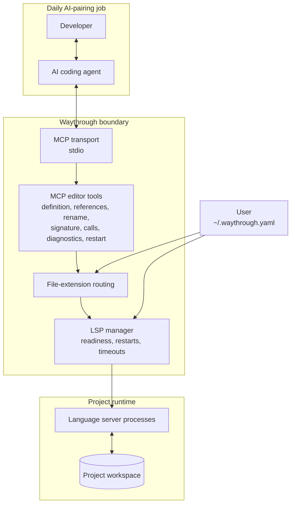

# Waythrough

Coding agents are great at reading code. Navigating an unfamiliar
codebase is harder: without language tooling, an agent has to search
for matching text and guess which definition or reference actually
matters.

Waythrough gives your agent a map. It runs your project's Language
Server Protocol (LSP) servers and exposes their code intelligence
through the Model Context Protocol (MCP). That means agents such as
Claude Code, Codex, and Antigravity can jump to definitions, find
references, inspect diagnostics, and safely plan renames—the same
kind of help you expect from a modern editor.

Instead of making your agent piece the codebase together one text
search at a time, let it ask the tools that already understand your
code.

## Architecture and the daily pairing loop

Waythrough sits between an AI coding agent and the project workspace. It
is the code-intelligence and language-server lifecycle layer: the agent
still owns the reasoning, edits, tests, and final decisions, while
Waythrough gives it precise answers from the language servers that already
understand the code.


```mermaid
flowchart TB
  subgraph pairing["Daily AI-pairing job"]
    developer["Developer"] <--> agent["AI coding agent"]
  end

  subgraph waythrough["Waythrough boundary"]
    mcp["MCP transport<br/>stdio"]
    tools["MCP editor tools<br/>definition, references, rename,<br/>signature, calls, diagnostics, restart"]
    routing["File-extension routing"]
    lifecycle["LSP manager<br/>readiness, restarts, timeouts"]

    mcp --> tools --> routing --> lifecycle
  end

  config["User<br/>~/.waythrough.yaml"] --> routing
  config --> lifecycle

  subgraph runtime["Project runtime"]
    servers["Language server processes"]
    workspace[("Project workspace")]
    servers <--> workspace
  end

  agent <--> mcp
  lifecycle --> servers
```

A typical AI-pairing coding day uses the boundary like this:

1. **Orient.** The agent asks for definitions and references instead of
   guessing from matching text.
2. **Understand.** It uses signature help and diagnostics while it works
   through an unfamiliar API or a failing change.
3. **Change.** The agent edits the workspace. `rename_symbol` returns a
   cross-file edit plan; it does not write files on the agent's behalf.
4. **Validate.** The agent runs the project's tests and checks, then uses
   diagnostics or a targeted `restart_server` when a language server is
   stale or unhealthy.
5. **Review and repeat.** The agent brings the results back to the
   developer for the next decision.

Configured language servers start on demand, so a normal session pays for
the language tooling it actually uses. Name the servers a workspace needs
with `serve --eager` to start them before the first tool call instead.
Waythrough reads one configuration file, `~/.waythrough.yaml`, so the same
setup follows you across shared repositories without adding a
repository-owned file.

## Status

This project is in early setup. It has eight MCP tools. Tests run
them against a test language server, not against a real one yet.

## Install

Waythrough publishes binaries for Linux and macOS, each for amd64 and
arm64. Use the installer you already have.

### Homebrew

This project is also its own Homebrew tap. Run these commands:

```sh
brew tap gustavofsantos/waythrough https://github.com/gustavofsantos/waythrough
brew trust gustavofsantos/waythrough
brew install waythrough
```

Homebrew 6 refuses to load a formula from a tap that you do not trust,
so the `brew trust` command is necessary. That command is new in
Homebrew 6. On an older Homebrew it does not exist, so skip it.

### mise

[mise](https://mise.jdx.dev) takes the binary straight from the GitHub
release through its `github` backend, so this path needs no Go
toolchain. Run this command:

```sh
mise use -g github:gustavofsantos/waythrough
```

To pin one version, name the release tag without its leading `v`:

```sh
mise use -g github:gustavofsantos/waythrough@0.1.0
```

An older mise names this same backend `ubi`. That name still works,
and mise removes it in 2027.1.

To build from source instead, use the `go` backend. This path needs
the Go toolchain, at the version in [go.mod](go.mod):

```sh
mise use -g go:github.com/gustavofsantos/waythrough/cmd/waythrough
```

A binary from the `go` backend reports its version as `dev`, because
`go install` does not apply the version flag that the release build
sets. Prefer the `github` backend when the version matters.

### From source

This path needs the Go toolchain, at the version in [go.mod](go.mod),
and GNU Make:

```sh
git clone https://github.com/gustavofsantos/waythrough
cd waythrough
make install
```

`make install` compiles the checkout, installs the binary with
`go install`, stamps the version from `git describe`, and then checks
that the `waythrough` your shell finds is the binary it just installed,
rather than an older copy from another installer. Run `make` with no
target to list the rest, or see
[CONTRIBUTING.md](CONTRIBUTING.md#dogfood-your-change).

## Quick start

1. Install the language server for the code you work on. `waythrough init`
   offers starter configurations for these common servers:

   | Languages | Server command |
   | --- | --- |
   | Clojure | `clojure-lsp` |
   | Go | `gopls` |
   | JavaScript and TypeScript | `typescript-language-server --stdio` |
   | Rust | `rust-analyzer` |
   | Python | `pyright-langserver --stdio` |

   The command must be on the `PATH` the coding agent gives Waythrough.
   The starter configurations use project-root marker lists derived from
   the corresponding declarative Neovim LSP configurations.

2. Create your user configuration and validate it:

   ```sh
   waythrough init
   # Select one or more numbered servers, or enter all.
   waythrough validate
   ```

   `init` writes `~/.waythrough.yaml` and never overwrites an existing file.
   Edit that file to change commands, arguments, environment, readiness,
   root markers, or file mappings. The selected entries are the complete
   runtime configuration; Waythrough has no hidden server defaults.

3. Add Waythrough as an MCP server in your coding agent's config. Have
   the agent start it with the project root as its working directory:

   ```json
   {
     "mcpServers": {
       "waythrough": {
         "command": "waythrough",
         "args": ["serve"]
       }
     }
   }
   ```

   `serve` reads `~/.waythrough.yaml` and starts each configured server only
   when a tool first needs its file type. If the file does not exist, `serve`
   fails and tells you to run `waythrough init`. Ask your coding agent to
   find a definition or list references. Waythrough forwards the request to
   that file type's server.

4. Tell your agent to use the tools. An agent that does not know they
   exist keeps searching for text. `waythrough instructions` writes a
   short block into the rules file your agent already reads:

   ```sh
   waythrough instructions --write AGENTS.md
   ```

   Use `CLAUDE.md`, `.cursor/rules/waythrough.md`, or whatever your tool
   reads in place of `AGENTS.md`. Waythrough appends the block the first
   time and replaces it every time after that, between the HTML comment
   markers it leaves behind, so run the same command again after an
   upgrade. It never appends a second copy, because a stale one would keep
   advertising the tools of the version that wrote it. Everything else in
   the file is left alone.

   The block names every tool below, with the arguments each one takes,
   and nothing else. Without `--write` the command prints it to stdout
   instead, to read first or to place by hand.

   In Claude Code, you can install the [plugin](#claude-code-plugin)
   instead.

5. Customize `~/.waythrough.yaml` when you need a different server, command,
   arguments, environment, readiness gate, root policy, or file mapping. For
   example, you can customize how gopls starts:

   ```yaml
   language_servers:
     - name: gopls
       command: company-gopls
       args: ["serve", "--company"]
       root_markers:
         - go.work
         - go.mod
         - .git
       filetypes:
         .go: go
   ```

   `root_markers` follows Neovim's priority rules. Waythrough searches every
   ancestor for the first list item before it tries the next item. A farther
   `go.work` takes priority over a nearer `go.mod` in this example.
   Put markers in a nested list when they have equal priority:

   ```yaml
   root_markers:
     - [package-lock.json, yarn.lock, pnpm-lock.yaml]
     - .git
   ```

   For an equal-priority group, the nearest ancestor containing any marker
   wins. The search starts at the file in each tool request. Marker
   resolution does not read the configuration path.

   If no marker matches, Waythrough uses the workspace root: the current
   working directory of `serve`. A file inside the workspace uses that root.
   A file outside the workspace fails with an error, so that a server never
   answers for code it did not index.

   Every configured entry starts on demand, unless `serve --eager` names
   it (see [below](#start-language-servers-before-the-first-tool-call)).
   One entry can run several processes, one for each project root. This
   lets one session work across several git worktrees, even with the MCP
   server in your global agent configuration. Waythrough picks the process for each file in this order:

   1. The process that already runs at the file's marker root.
   2. A process whose root contains the file, in the same git checkout. A
      nested module uses its repository's process. A worktree nested inside
      a repository has its own `.git`, so it does not.
   3. For a file in no git checkout, the process that the last request
      used. A module cache or a toolchain's sources is not a project of its
      own. The agent usually reaches it from a definition in its project,
      and that project's process knows how the project uses the code.
   4. Otherwise, a new process at the marker root, or at the workspace
      root.

   Tools accept absolute file paths anywhere. A relative path resolves
   against the working directory of `serve`, but only when that directory
   is inside a git checkout. Some agents start a globally configured MCP
   server in your home directory, where a relative path names no file you
   meant, so Waythrough asks for an absolute path instead.

   One entry runs at most four processes at once. A request that needs a
   fifth fails with an error that names the roots in use. `restart_server`
   restarts the entry at every root. A restart before any file request
   starts the server for the workspace root.

   `waythrough validate` checks the same `~/.waythrough.yaml` file that
   `serve` reads. Empty files and unknown configuration fields are rejected.

## Claude Code plugin

In Claude Code, a plugin can take the place of the instructions block in
step 4. It adds a `waythrough` skill. The skill tells Claude which tool
answers which question, how to give a position, and what to do when a
call fails or is slow. It also lets Claude call the eight Waythrough
tools without a permission prompt each time.

[Install the binary](#install) and create your configuration, then
connect the MCP server and install the plugin:

```sh
claude mcp add --scope user waythrough -- waythrough serve --shared
```

```
/plugin marketplace add gustavofsantos/waythrough
/plugin install waythrough@waythrough
```

Claude loads the skill when a task needs to navigate code. You can also
run `/waythrough:waythrough`. The skill expects the MCP server under the
name `waythrough`, as the command above registers it, because Claude
Code names the tools after the server.

The plugin and the instructions block steer the agent in the same way,
so you need only one of them. A spec checks that the skill names exactly
the tools the server registers.

## Start language servers before the first tool call

Some language servers take a long time to start and index. By default,
the first tool call that needs a server waits for that. When you know
which servers a workspace uses, name them with `--eager`, and `serve`
starts them at once, for the workspace root, while the agent gets going:

```json
{
  "mcpServers": {
    "waythrough": {
      "command": "waythrough",
      "args": ["serve", "--eager=gopls"]
    }
  }
}
```

Give several names separated by commas, or repeat the flag. Each name
must be the `name` of an entry in `~/.waythrough.yaml`; an unknown name
stops `serve` with an error. `serve` does not wait for the servers to be
ready, so the agent connects as fast as before. A server that fails to
start is reported by `get_status`, as on demand.

Name only the servers the workspace needs. Every server you name indexes
the workspace root, whether or not a tool call ever reaches it. A server
with `root_markers` starts eagerly only when one of its markers matches
from the workspace root. When none does, for example in a workspace whose
projects all sit in subdirectories, it starts on demand as usual. Then
each project gets its own process, rather than one at the root that
contains them all. With `--debug`, `serve` logs each server it skips.

With `--shared`, `--eager` applies to the daemon that the session starts,
as `--linger` does. A session that connects to a running daemon does not
change it.

## Share language servers across sessions

Each `serve` starts its own language servers. When you run several
agent sessions in one repository, each of them indexes the same code
again. Pass `--shared` so that all of them use one set of servers:

```json
{
  "mcpServers": {
    "waythrough": {
      "command": "waythrough",
      "args": ["serve", "--shared"]
    }
  }
}
```

The first `--shared` session in a workspace starts a background daemon.
That daemon starts the language servers when a tool first needs them,
as `serve` does without the flag. Every later session in the workspace
connects to the same daemon, so it gets answers from servers that are
already indexed.

When the last session closes, the daemon keeps its servers for one
minute, then stops them and exits. A session that crashes counts as
closed. The one-minute wait keeps the index warm when an agent
reconnects, or when you start the next session soon after the last one.
Set `--linger=0s` to stop at once, or give a longer duration, such as
`--linger=10m`. The session that starts the daemon sets this value.

These sessions share a daemon:

- They start in the same directory.
- They read the same `~/.waythrough.yaml`, byte for byte.
- They run the same `waythrough` build.
- They have the same `PATH`.

A session that differs in any of these gets its own daemon. For example,
if you edit the configuration, the next session starts a new daemon. The
old daemon stops when its own sessions end. Language servers inherit the
environment of the session that started the daemon. To pin a variable
that a server needs, set it in that server's `env` in the configuration.

The daemon keeps its socket, its locks, and its log in a private
directory, so only your user can connect:

- `$XDG_RUNTIME_DIR/waythrough/` when that variable is set.
- Otherwise, `waythrough-<uid>` in the system temporary directory.

With `--debug`, the daemon writes its records to `<key>.log` in that
directory, in place of your agent's stderr, at the debug level of the
session that started it. Each new daemon clears its log. A log stops
growing at 16 MiB.

If the daemon is killed, the language servers it started lose their
parent. Most of them, `gopls` among them, exit when their input closes.
A server that does not exit keeps running beside the copy that the next
daemon starts. A `serve` that is killed without `--shared` leaves the
same gap.

`--shared` works on Linux and macOS.

### Check on running daemons

Run `waythrough status` from any directory to see every daemon that runs
for your user. Your agent sees the same report for its own workspace
through the `get_status` tool (see [Tools](#tools)):

```text
/home/me/project  [healthy]
  daemon    pid 31774, waythrough v0.2.0, up 2h14m, serving
  sessions  2 active of 64, 9 since start, 0 refused
  runtime   31 goroutines, 2.4 MiB heap, 18.1 MiB total
  log       /run/user/1000/waythrough/d379a940b7f939082ae3fa5615750141.log

  SERVER  ROOT  STATUS  HEALTH   PID    UP     STARTUP  RSS      DOCS  REQUESTS  FAILED  RECENT FAILED  P50   P95    MAX   CRASHES
  gopls   .     ready   healthy  31785  2h13m  6.1s     812 MiB  14    1520      3       0/64           38ms  310ms  1.2s  0/3
```

For each daemon, the report shows its workspace, its state, and its
sessions. For each language server, it shows the root the server
indexes, its process and resident memory, how long it took to become
ready, and the files it has open. It also shows the requests the server
served and how many failed. The recent figures cover the last 64
requests, so they show a server that worked for hours and fails now.
A request that Waythrough refuses before it asks the server does not
count as a failure. Examples are a file it cannot read, or diagnostics
from a server that does not offer them. The JSON counts these as
`refused`.
CRASHES shows the exits in the last minute against the restart limit.
A server that is not used yet shows as `idle`. Resident memory shows
only on Linux.

Each daemon and each server gets one health word:

- `healthy`: nothing below applies.
- `degraded`: the server crashed in the last minute, or it is still
  starting after 30 seconds, or at least one in four of its recent
  requests failed. A daemon at its session limit is also degraded.
- `failing`: the server crashed more often than the restart limit
  allows, and it answers nothing until `restart_server` restarts it.

A daemon is as healthy as its least healthy server. The last error of
each server shows under the table.

`waythrough status --json` prints the same reports as JSON, for a
script or a dashboard. Read the status as often as you like: it never
counts as a session, so it never keeps an idle daemon running. A
killed daemon leaves its sockets behind. When no daemon holds the
key's lock, `status` removes those sockets and says so.

## Tools

Waythrough exposes these MCP tools to a connected coding agent:

- `get_definition` — find where a symbol's definition is, given a
  file position.
- `list_references` — find every place that uses a symbol, given a
  file position.
- `rename_symbol` — build the list of edits that rename a symbol,
  across every file it touches. It does not write the edits to disk.
  Your agent applies them.
- `signature_help` — list the signatures a call could match, given a
  file position inside that call. It also says which signature and
  which parameter the position is on.
- `get_call_hierarchy` — list one level of direct incoming or outgoing
  calls for the symbols at a file position. Set `direction` to
  `incoming` or `outgoing`. The tool returns each symbol and its call
  sites as 1-based file locations. It queries at most 16 prepared roots,
  with at most four directed requests in flight. Each directed response has
  an 8 MiB limit. After the language server is ready, the hierarchy operation
  has a 30-second deadline. It accepts at
  most 4,096 calls and 16,384 call sites across all roots, and returns an
  explicit error instead of a partial result. A language
  server that does not advertise call hierarchy support also returns an
  explicit error. Static call hierarchies can omit dynamic calls. Use
  `list_references` when you need a broader search.
- `get_diagnostics` — list the problems a language server finds in a
  file. The language server must advertise pull diagnostics at its
  handshake. One that does not fails the call with an error naming it,
  rather than reporting a clean file. `gopls` pushes its diagnostics
  by default and advertises no pull support, so it fails this call
  today.
- `restart_server` — restart one language server by name. The call
  returns only when the replacement can answer, so the next call
  does not reach a server that is still starting. Every other
  language server keeps running. Use it when a server's answers no
  longer match the code on disk. Waythrough cannot see that a
  server answers from a stale index, so your agent must decide.
  With `--shared`, the restart reaches every session in the
  workspace. A call those sessions have in flight fails and says the
  server restarted.
- `get_status` — report the health of the language servers behind
  these tools. It takes no arguments and returns the same report as
  `waythrough status --json`, for the current process only. The
  report covers which servers run and for which root, whether each
  is ready, still starting, degraded, or failing, its recent latency
  and failures, and its last error. With `--shared`, it also reports
  the sessions that share the servers. An agent uses it when a call
  fails or is slow, to decide whether to wait or to call
  `restart_server`.

  `get_status` also comes with a page. A host that supports the
  [MCP Apps](https://modelcontextprotocol.io/extensions/apps)
  extension, such as Claude, shows the page beside the result: the
  health of each server, summary tiles, a table of servers, and the
  last errors. It also has a Refresh button and an optional refresh
  every 5 seconds. Automatic refresh stops after 10 minutes, and
  pauses while the page is hidden. The page loads nothing from the
  network. A host without MCP Apps shows the report as data.

File-based tools accept regular source files up to 16 MiB. Waythrough rejects
larger files and non-regular paths before it sends content to a language server.

## See what it is doing

`serve` is quiet by default: it says nothing on its own, because
stdout carries the MCP protocol frames and stderr belongs to whatever
your coding agent chooses to show you.

Pass `--debug` when you want to know whether Waythrough is earning
its place in your agent's tool list:

```json
{
  "mcpServers": {
    "waythrough": {
      "command": "waythrough",
      "args": ["serve", "--debug"]
    }
  }
}
```

Every record goes to stderr, never to stdout, and covers three
things:

- **Every MCP request.** Which tool your agent called, the arguments
  it sent, how long the answer took, and what came back. A tool that
  answers with nothing and a tool that answers with twelve locations
  are the two cases worth telling apart, so the answer itself is
  recorded, capped at 2 KB per record.
- **Every language server's lifecycle.** Starting, ready, exited,
  restarted, and gave up. This is usually why a tool call reports a
  server still starting.
- **Every language server's own stderr.** A server that will not
  start explains itself there and nowhere else. Waythrough discards
  that stream without `--debug`.

The records name file paths and carry tool results, which include
your source code for a rename. They go wherever you send stderr and
nowhere else, but that is the reason `--debug` is a flag rather than
the default.

### Read the records

Waythrough writes to stderr and does nothing else with it. It has no
log file of its own, because a stream is already the thing your shell
knows how to put wherever you want it.

Your agent starts Waythrough, so redirect stderr where the agent
starts it. An `args` array holds no redirect, so make the command a
shell:

```json
{
  "mcpServers": {
    "waythrough": {
      "command": "sh",
      "args": [
        "-c",
        "exec waythrough serve --debug 2>>/tmp/waythrough-debug.log"
      ]
    }
  }
}
```

Then read it as it fills:

```sh
tail -f /tmp/waythrough-debug.log
```

Two details make this safe. `exec` replaces the shell with
Waythrough rather than leaving one wrapped around it, so your agent
talks to Waythrough directly and a signal reaches the right process.
`2>>` moves stderr alone, so stdout still carries the protocol
frames, and appending keeps the log across restarts.

Your agent may already keep this for you. Claude Code, for one,
writes each MCP server's output under
`~/.cache/claude-cli-nodejs/<project>/mcp-logs-waythrough/` on Linux,
and under `~/Library/Caches/` in place of `~/.cache/` on macOS. Look
there first: if you find the records, you need no redirect at all.

## Learn more

- [CONTRIBUTING.md](CONTRIBUTING.md) — set up your tools, run the
  checks, and submit a change.
- [docs/ARCHITECTURE.md](docs/ARCHITECTURE.md) — the file layout
  and how a request flows through the code.
- [LICENSE](LICENSE) — the license for Waythrough.
