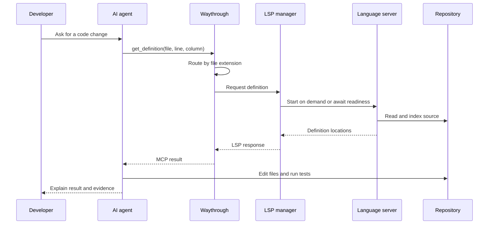
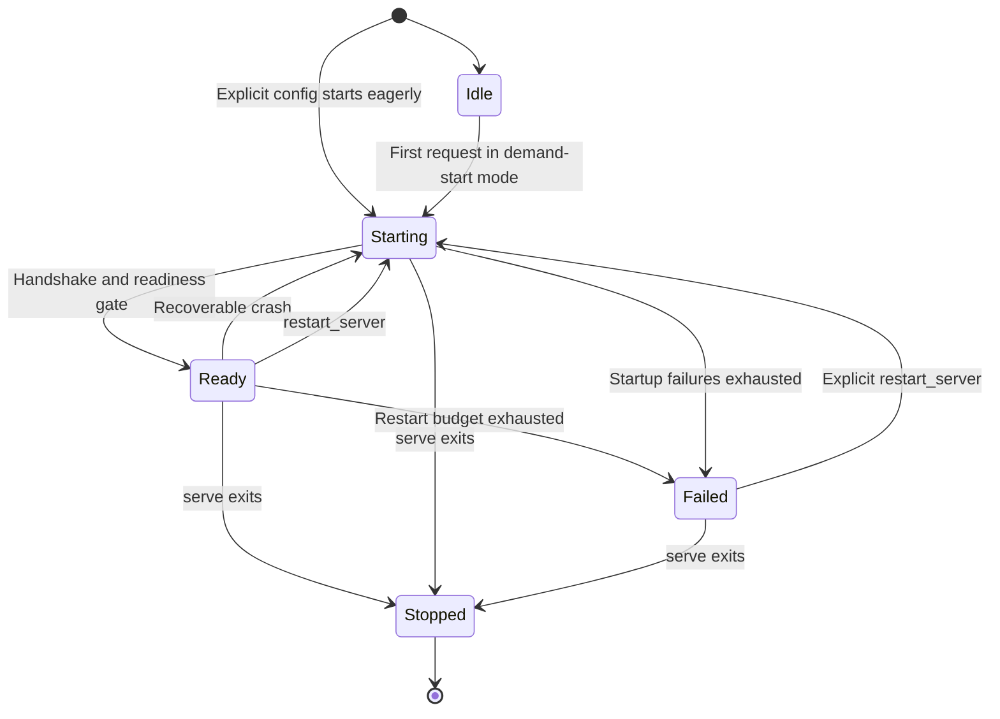

# Architecture

This document describes the file layout of Waythrough, and how a
request flows through the code. Read
[CONTRIBUTING.md](../CONTRIBUTING.md) first for how to set up your
tools and check a change.

## File layout

| Path | Content |
| --- | --- |
| `cmd/waythrough/` | The `main` package. It only calls `cli.Execute`. |
| `internal/cli/` | The `waythrough` command-line interface: `init`, `validate`, and `serve`. |
| `internal/config/` | The built-in language-server defaults and the `waythrough.yaml` schema, loader, and validator. |
| `internal/lsp/` | Process lifecycle for each configured language server, and the LSP client that talks to it. |
| `internal/lsp/fakelsp/` | A small language server built only for `internal/lsp` tests. |
| `internal/editor/` | The MCP server. It turns each MCP tool call into an LSP request, and the LSP response back into MCP output. |
| `scripts/` | `check.sh`, the check script, and `install-git-hooks.sh`, the hook installer. |
| `.github/workflows/` | The CI workflow and the release workflow. |
| `.tools/` | A gitignored directory. It holds the pinned `golangci-lint` binary. |
| `.goreleaser.yaml` | The GoReleaser config for the release build and the Homebrew tap. |
| `waythrough.yaml` | An optional repository override, used when you run Waythrough from this repository. |

## How a request flows

1. A coding agent starts `waythrough serve` over stdio, as an MCP
   server.
2. `internal/cli` loads `waythrough.yaml` when it exists, or uses the
   built-in configuration when the implicit path is absent, then validates
   the result through `internal/config`. An explicit `--config` path never
   falls back. A repository file replaces all defaults rather than merging
   with them.
3. `internal/cli` starts an `internal/lsp` manager. For built-in defaults,
   the manager starts a server on the first request routed to it; concurrent
   first requests share one supervisor. A repository configuration preserves
   eager startup for every entry. Each server gates requests until it is
   ready.
4. `internal/cli` builds the MCP server from `internal/editor`. This
   step registers the `get_definition`, `list_references`,
   `rename_symbol`, `signature_help`, `get_diagnostics`, and
   `restart_server` tools.
5. The MCP server serves tool calls until the agent's session ends.
   `internal/editor` routes each call, by the file extension in the
   call, to the language server that handles it. It sends the LSP
   request through the `internal/lsp` manager, and it turns the LSP
   response into the tool's output shape. `restart_server` is the
   one tool that names its language server instead, because it acts
   on a whole server rather than on a file.
6. When `serve` exits, it shuts down every language server the
   manager started.

### Request sequence

This sequence shows the runtime path for a navigation request. The same
boundary applies to the other tools, with their LSP method and output shape
changed as appropriate.

## Readiness

An LSP server's process can start before the server can answer a
request. `internal/lsp` gates on one of two readiness signals, set
per server in `waythrough.yaml`:

- `progress` — the default. The manager waits for every LSP
  `workDoneProgress` token the server opens to close.
- `handshake` — an opt-in for a server with no background indexing.
  The manager treats the server as ready as soon as the
  initialize and initialized handshake completes.

A restart passes the same gate. The manager stops the old process,
starts a new one, and reports ready only when that new process
passes the gate itself.

Each start of a process is one attempt, and the manager numbers
them. A stopped process can still send messages while its
replacement starts, so every readiness signal carries the attempt
that produced it. The manager drops a signal from an attempt it has
already replaced. Without this, a message from the stopped process
would report the replacement ready before that server had indexed
anything.

## Server lifecycle

Once a language server starts, one goroutine owns it through shutdown.
Built-in servers have no goroutine until their first request; the manager's
single-flight gate lets exactly one such request create the owner. That
goroutine starts the process, runs the handshake, and waits for the process
to exit. Then it starts another process, unless the server has exited more
often than the restart limit allows. A server in that state waits for a
restart without releasing its owner.

This has two results. Every process starts on the context `Start`
received, so no single tool call can end a language server when
that call returns. And a restart of a server that gave up needs no
new goroutine.

The lifecycle can also be read as this state machine:

## Debug logging

`serve --debug` builds one `*slog.Logger` in `internal/cli/debug.go`
and hands it to both `internal/lsp` and `internal/editor`. Without
the flag, that constructor returns a logger over `slog.DiscardHandler`
instead, and every component checks `Enabled` before doing work only
a record would use.

The logger writes to the command's stderr and is refused outright if
handed `os.Stdout`. `serve` speaks MCP over stdio, so stdout carries
JSON-RPC frames and nothing else; one log byte written there
desynchronizes the framing and the session is lost. That is a
programmer mistake rather than a runtime failure, so
`internal/cli/debug.go` panics rather than returning an error.

Three sources feed it:

- `internal/editor/logging.go` installs MCP receiving middleware that
  records each request, its arguments, its duration, and its answer.
  It returns the wrapped handler's result and error untouched.
- `internal/lsp/manager.go` records each server's lifecycle
  transitions.
- `internal/lsp/serverlog.go` turns a language server's own stderr
  into one record per line. Waythrough sets `cmd.Stderr` to
  `io.Discard` when debug logging is off, so a server's output costs
  nothing to ignore.

Both the tool answers and the stderr lines are capped, because
neither a language server's output nor an agent's arguments have a
size Waythrough controls.

Waythrough writes the records to stderr and offers no way to write
them anywhere else. A `--log-file` flag was considered and rejected:
it would be a second way to do what a shell redirect already does,
and two ways to reach one behaviour is one way too many. README.md
shows the redirect.

## Configure language servers

`internal/config/defaults.go` configures clojure-lsp, gopls,
typescript-language-server for JavaScript and TypeScript, rust-analyzer,
and pyright-langserver. These five entries are a fixed bound: default
resolution performs no repository walk, and only a server selected by a
tool call starts and indexes the workspace.

Add `waythrough.yaml` to customize startup or use any other language server.
The next `serve` start reads that file as the complete configuration. See the
`language_servers` schema in `internal/config/config.go`.

## Add an MCP tool

Add the tool to `internal/editor/editor.go`, and add the LSP call it
needs to `internal/lsp/manager.go`. Add tests at both levels: an
`internal/lsp` test against `fakelsp`, and an `internal/editor` test
for the tool's input and output shape.
