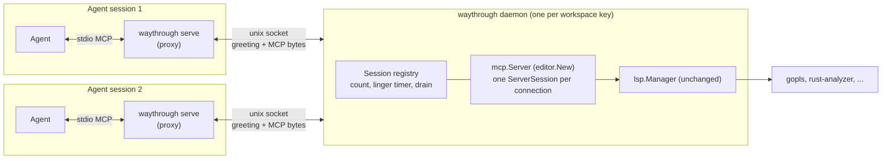
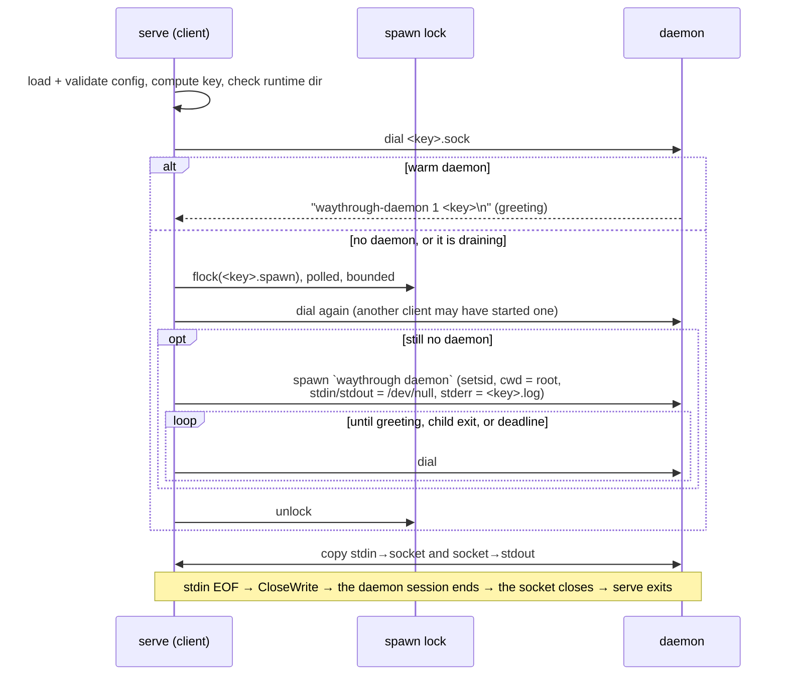
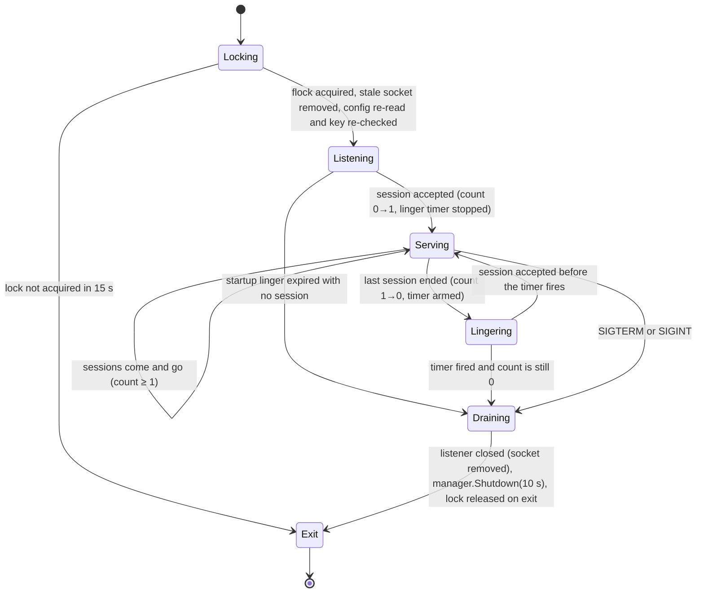

# Design: shared language servers across agent sessions

Status: **proposal, awaiting review**. No code has changed yet.

## Problem

Each `waythrough serve` process owns its own `lsp.Manager`, so every
agent session starts, and indexes, its own copy of every language server
it uses. Three agents working in one repository run three `gopls`
processes that index the same files. On a large workspace, each copy costs
minutes of CPU and gigabytes of memory, and each new session pays the cold
start again.

## Goal

- At most one copy of each configured language server runs per
  workspace, whatever the number of agent sessions in that workspace.
- The first session that needs the servers starts them automatically.
- The servers stop automatically when no session is connected.
- The agent configuration stays `waythrough serve` over stdio. Users do
  not start, stop, or point anything at a daemon by hand.

## Non-goals

- Sharing across users, machines, or containers.
- Sharing across workspaces. Two git worktrees are two workspaces: each
  holds different files, so each needs its own index.
- Windows. Waythrough releases only for Linux and macOS today.

## What the investigation found

| Finding | Evidence |
| --- | --- |
| The whole server lifecycle is in `lsp.Manager`. `serve` only creates it, connects stdio MCP, and calls `Shutdown` when the session ends. | `internal/cli/serve.go:41-84` |
| The MCP layer is already independent of the transport. `editor.New` returns one `*mcp.Server`, and the SDK supports several concurrent sessions on one server. | `internal/editor/editor.go:30`. The SDK note is at `go-sdk/mcp/server.go:1283`. |
| A prototype served two concurrent MCP sessions from one `mcp.Server` over Unix-socket `mcp.IOTransport`s. Two 200 ms tool calls finished in 200 ms in total. | Throwaway prototype, run in this investigation. |
| The kernel releases a `flock` held by a process that gets SIGKILL. The listening side sees the session end when the client process gets SIGKILL. | Same prototype. |
| `UnixListener.Close` removes the socket file. A daemon that gets SIGKILL leaves a stale socket file behind, and a dial to it fails. | Same prototype. |
| **Existing race, which sharing makes worse.** `syncFileOnAttempt` reads `openFiles[path]`, releases the lock, sends the notification, and then writes the new state. Two concurrent tool calls on one file can both send `didOpen`. They can also both send `didChange` with the same version number but different text, and leave the server holding the older text. | `internal/lsp/manager.go:1649-1701` |
| Relative tool paths resolve against `Manager.root`, which is the `serve` working directory. | `internal/lsp/manager.go:932` |
| `env` and `initialization_options` are parsed from the configuration but never applied to a server. | Only `config.go:76-77` uses them. |

## Options considered

| Option | Verdict |
| --- | --- |
| **A. Per-workspace daemon. `serve` becomes a thin stdio-to-socket proxy.** The daemon runs today's `Manager` and MCP server, one MCP session per socket connection. | **Chosen.** It reuses all of the existing lifecycle code. Each session's lifetime is a socket's lifetime, so the kernel does the reference counting, including when a process crashes. |
| B. Multiplex the LSP connection. Each `serve` keeps its own MCP server and shares one LSP process through a JSON-RPC mux. | Rejected. LSP is stateful per client: document versions, progress tokens, and server-to-client requests. The mux would have to reimplement much of `Manager`. |
| C. Streamable HTTP daemon that agents connect to by URL. | Rejected. Nothing starts or stops it automatically. It also needs a port, authentication, and an HTTP transport in every agent. |
| D. PID files with heartbeats to count sessions. | Rejected. A crash leaves stale entries that the code must detect and expire. `flock` and socket EOF are released by the kernel. |
| E. The first `serve` process hosts the servers, and later ones attach to it. | Rejected. When the first agent exits, the host is gone while other sessions still use it. A hand-off protocol costs more than a separate process. |

## Design

### Components

- `waythrough serve` keeps its command line and its stdio contract. In
  shared mode, it validates the configuration, attaches to the
  workspace's daemon (or starts one), and then copies bytes in both
  directions.
- `waythrough daemon` is a new hidden subcommand. Only `serve` runs it.
  It owns the `lsp.Manager` and the `mcp.Server`, and serves one MCP
  session for each accepted connection.
- A new package, `internal/daemon`, holds the workspace key, the runtime
  directory checks, the locks, the session registry, and the client
  attach and proxy code. `internal/lsp` and `internal/editor` get no
  changes other than prerequisite P1 below.

### Workspace key

One daemon serves exactly one key. The key is the first 128 bits of a
SHA-256 hash, in hex, over these inputs, each with a length prefix:

1. **Binary identity.** This is the version string, plus the size and
   modification time of the executable. Every `go install` build
   reports `dev`, so the version alone cannot tell two of them apart.
2. **Workspace root.** This is `filepath.EvalSymlinks(os.Getwd())`.
   Every session on a daemon has the same root, so relative tool paths
   resolve as they do today.
3. **The bytes of the configuration file.** If the user edits
   `~/.waythrough.yaml`, the next session gets a new daemon. The old
   daemon stops when its last session ends. No session ever attaches to
   servers started from a stale configuration.
4. **`PATH`.** The daemon's servers inherit its environment, and `PATH`
   selects the server binary. See open question Q3.

A key never identifies two different setups. A change to any of these
inputs costs, at most, a second daemon for a time. It never gives a wrong
answer.

### Runtime directory and files

- On Linux, the directory is `$XDG_RUNTIME_DIR/waythrough/` when that
  variable is set. Otherwise it is `os.TempDir()/waythrough-<uid>/`. On
  macOS, `os.TempDir()` is already a directory for each user.
- `waythrough` creates the directory with mode `0700`. Before every use,
  it calls `Lstat` on the directory and refuses to continue if any of
  these is true: the path is not a directory, it is a symlink, it is not
  owned by the effective uid, or `mode & 0o077 != 0`.

  This check is the security boundary. A process that can connect to
  the socket can make the language servers read any file the user can
  read.
- The directory holds these files for each key:

  | File | Purpose | Lifetime |
  | --- | --- | --- |
  | `<key>.sock` | Listening socket, mode `0600`. | Removed when the daemon drains. If the daemon crashes, the next daemon replaces it. |
  | `<key>.lock` | The daemon holds an exclusive `flock` on it for its whole life. This proves that a daemon is alive. | Never removed. Removing a file that holds a `flock` lets two processes lock two different inodes. |
  | `<key>.spawn` | A client holds an exclusive `flock` on it while it attaches or starts a daemon. Only one client at a time starts a daemon. | Never removed. |
  | `<key>.log` | The daemon's stderr. It is truncated at each daemon start and capped at 16 MiB. | Replaced by the next daemon. |
- The full socket path must fit in `sun_path`: 108 bytes on Linux and
  104 on macOS. The path is `dir + 38` bytes. The client checks the
  length and fails with a clear error when the path is too long.

### Attach: `serve` in shared mode

- The attach sends one greeting line before any MCP bytes. A client
  whose dial succeeded can still be in the listen backlog of a daemon
  that has just begun to drain. The kernel then resets that connection.
  The daemon sends the greeting only after it has registered the
  session. A greeting therefore means a daemon has accepted this
  session. If the client reads EOF or a reset in place of the greeting,
  it repeats the attach.

  The greeting line has a 64-byte limit and a 5 s read deadline. It
  holds a protocol version and the key, and the client checks both.
- All attach steps share one deadline: **30 s**. This covers the wait for
  the spawn lock, a predecessor's drain, and the daemon's start. If the
  deadline expires, `serve` fails and names `<key>.log`. It does not
  fall back to a private manager. A silent fallback would hide a fault
  and bring back the duplicate servers this design removes.
- The client calls `Wait` on the daemon it started from a goroutine.
  This collects the process if the daemon exits before the client does,
  and an early exit ends the polling at once. A detached daemon that
  outlives `serve` is reparented to init and is not affected.
- SIGINT or SIGTERM to `serve` closes the socket and exits. The daemon
  sees EOF and does not stop. SIGKILL to `serve` has the same effect,
  because the kernel closes the socket.
- The proxy adds one Unix-socket hop to each message: two copies, in the
  range of tens of microseconds. A language-server request takes
  milliseconds to seconds.

### Daemon lifecycle

1. **Lock.** The daemon polls `flock(<key>.lock, LOCK_EX|LOCK_NB)` for up
   to 15 s. The poll waits out a predecessor that is still draining:
   `Manager.Shutdown` takes up to 5 s per server, and it stops all
   servers in parallel. While the daemon holds the lock, no other
   daemon for the key is alive, so it can safely remove a stale
   `<key>.sock`.
2. **Check the key again.** The daemon reads the configuration itself
   and computes the key from what it read. If that key differs from the
   `--key` argument, it exits. The file changed between the client's
   read and the daemon's read. The client times out or sees the early
   exit, and the next attach computes the new key.
3. **Serve.** The daemon calls `lsp.NewManager(root, ..., WithDemandStart())`
   and `editor.New` once. For each accepted connection, it does these
   steps:
   1. It takes the registry lock.
   2. It refuses the connection if the daemon is draining or already has
      `maxSessions` (64) sessions.
   3. Otherwise, it increments `count` and stops the linger timer.
   4. It releases the lock and writes the greeting.
   5. It runs `server.Connect(lifetimeCtx, &mcp.IOTransport{conn, conn})`
      and then `Wait()`.
   6. When the session ends, it decrements `count` under the lock and
      arms the timer when `count` reaches 0.
4. **Linger.** The timer carries a generation number that every arm and
   every stop increments. A timer that fires with an old generation does
   nothing. The daemon arms the timer once at startup too. A daemon whose
   client died before it attached therefore stops by itself.
5. **Drain.** All of these happen in one hold of the registry lock: the
   daemon sets `draining`, then closes the listener, which removes the
   socket file. After that, it calls `manager.Shutdown` with a bounded
   context and exits. The kernel releases `<key>.lock`.

A daemon process ignores SIGHUP. `setsid` also takes it out of the
agent's terminal session and process group. This prevents a Ctrl-C in
one agent from stopping servers that other agents use.

### Invariants and where they are checked

| Invariant | Enforced by |
| --- | --- |
| At most one daemon is alive for each key. | The exclusive `flock` on `<key>.lock`, held for the daemon's whole life and released by the kernel on any exit. |
| At most one client starts a daemon for a key at a time. | The `flock` on `<key>.spawn`, plus a second dial after the lock is acquired. |
| A greeting means a live, registered session. | The daemon writes the greeting only after it increments `count`, under the same lock that `draining` uses. |
| `count` equals the number of live sessions. | Each session goroutine decrements exactly once, in a `defer` after `Wait`. A crashed client closes its socket, and that ends `Wait`. |
| Servers stop only when no session is connected. | Drain requires `count == 0` and a current timer generation, both checked under the registry lock. |
| Only the same user can connect. | The checks on the runtime directory's owner, mode, and symlink status, plus socket mode `0600`. |
| A daemon never runs with a configuration other than the one its key names. | The daemon computes the key again. |

### Bounds

| Resource | Bound |
| --- | --- |
| Sessions per daemon | 64. Beyond that, the daemon refuses with an explicit error line. |
| Attach time | 30 s, one deadline for every attach step |
| Daemon lock wait | 15 s |
| Greeting | 64 bytes, 5 s read deadline |
| Drain | `manager.Shutdown`, 10 s context, 5 s kill grace per server |
| Linger | Default 60 s, configurable (see Q2) |
| Daemon log | 16 MiB per daemon life. Truncated at start, with a marker line when the cap is reached. |
| Daemons | One per distinct key. Each one stops itself when it has no sessions. |

Cost estimate: N sessions in one workspace go from N copies of each server
to 1. That saves (N−1) × the server's RSS, and (N−1) × the indexing CPU
for every session after the first. Each session adds one small proxy
process, about the cost of today's `serve` minus the language servers it
used to hold. A warm attach is one dial and one greeting. It is
sub-millisecond and replaces a cold index.

### Behavior changes that sessions can see

- **`restart_server` affects every session.** In-flight calls in other
  sessions fail with the existing "restarted while this call was in
  flight" error. This is the existing contract, but it now reaches
  further. The tool description should say so.
- **Debug logging.** Today, `--debug` sends server and request records to
  the agent's stderr. A shared daemon has no agent stderr. It writes to
  `<key>.log`, at the debug level that the session that started it
  asked for. A later session with `--debug` writes its own attach
  records to its stderr, together with the log path. See Q4.
- **Environment.** Servers inherit the environment of the session that
  started the daemon. Today, they inherit their own session's
  environment.

### Prerequisite fixes

- **P1. Serialize file synchronization per server.** Hold a sync mutex on
  `serverProcess` across the steps that read the file, compute the
  notification, send it, and store the new state. The cost is bounded:
  files are at most 16 MiB, and the hold is one notification write.
  This fixes the existing race described above. With shared sessions,
  concurrent calls on one file become routine.
- **P2. Apply or reject `env`.** Waythrough accepts the `env` field but
  ignores it. Once daemons outlive the session that started them, a
  per-server `env` is how a user pins the environment a server runs
  with. Apply it in `startProcess` (`cmd.Env = append(os.Environ(),
  ...)`), or make `validate` reject it until it is applied. Either way,
  the field must not stay silently ignored. The same applies to
  `initialization_options`, but it is not blocking here.

## Test plan

Integration tests build the binary and use `fakelsp` with a new
`-spawn-log` flag, which appends a line on every start:

1. Two sessions in one workspace get correct answers, and there is one
   spawn.
2. Sixteen concurrent cold `serve` processes start exactly one daemon
   and one server process.
3. The last session disconnects. After the linger time, the daemon
   exits, the server process is gone, and the socket file is removed.
   With linger 0, this happens at once.
4. A client gets SIGKILL. The count drops, and the daemon drains as in
   test 3.
5. A client arrives during a drain. It retries after the missing
   greeting, and a new daemon serves it.
6. The daemon gets SIGKILL, which leaves a stale socket. The next
   `serve` removes the socket and starts a new daemon.
7. The configuration file changes. The next session gets a second
   daemon, and the first daemon stops when its sessions end.
8. The runtime directory is group-writable, is a symlink, or has a
   different owner. `serve` refuses, with an error that names the
   problem.
9. A socket path that is too long fails with an explicit error.
10. For P1: concurrent synchronizations of one file from two sessions
    send exactly one `didOpen`, strictly increasing versions, and end
    with the newest text.

## Delivery slices

1. **P1, the synchronization fix.** It has value alone, and sharing
   depends on it.
2. **Shared mode, happy path.** Covers the key, the runtime directory,
   the locks, the start, the greeting, the proxy, the count, and linger
   teardown. Tests 1–4 and 8–9.
3. **Recovery.** Covers the drain race, stale sockets, configuration
   changes, the session limit, and the log cap. Tests 5–7.
4. **Documentation.** README, ARCHITECTURE (a new lifecycle diagram),
   and the `restart_server` description.
5. **Optional.** `waythrough status`, which lists live daemons by
   checking each `<key>.lock` with `LOCK_NB`. Also, switching the
   default mode (Q1).

## Open questions for review

- **Q1. Default or opt-in.**
  - *Recommendation:* ship as `serve --shared`, use it for a while, and
    then make it the default. Keep `--standalone`, today's in-process
    behavior, as the escape hatch and for tests.
  - *Alternative:* make it the default from slice 2. That gives one mode
    fewer to explain, but every user hits the first bugs.
- **Q2. Linger after the last session.**
  - *Recommendation:* 60 s by default, set by `serve --linger=<duration>`
    on the session that starts the daemon. `0` stops the servers at
    once.
  - Agents restart MCP servers on reconnect, and work often moves from
    one session to the next. A linger of 0 throws away a warm index for
    a reconnect that takes one second.
- **Q3. Which environment goes into the key.**
  - *Recommendation:* `PATH` only, and rely on configuration `env` (P2)
    for anything else a server needs, such as `VIRTUAL_ENV` or
    `GOFLAGS`.
  - Hashing the whole environment would almost never share, because
    agents set variables for each session.
- **Q4. Debug logging in shared mode.**
  - *Recommendation:* a daemon log file at the debug level of the session
    that started the daemon, as described above.
  - *Alternative:* debug logging always on in the daemon. That writes
    source text, through rename results, to disk in every run. The
    directory is `0700`, but the README promises that this happens only
    with `--debug`.
